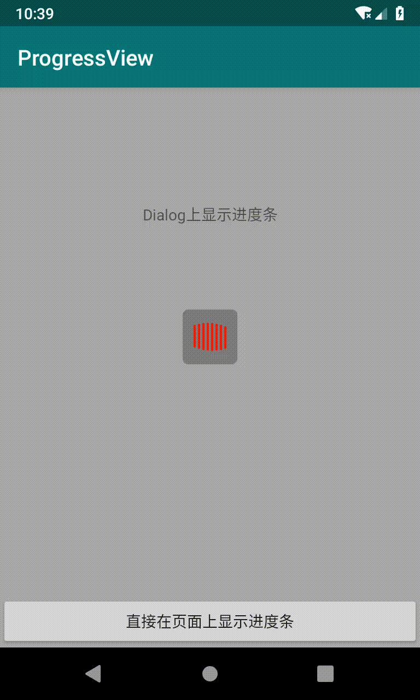
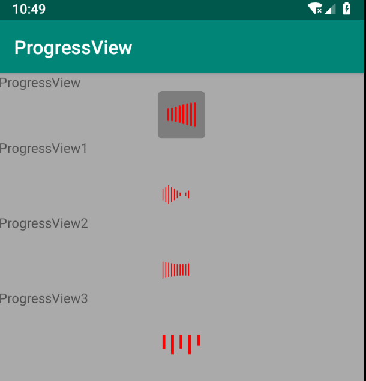

# ProgressViews

基于Canvas重绘处理的进度条，加载条

[https://github.com/ccMagic/ProgressViews](https://github.com/ccMagic/ProgressViews)


### 主样式



### 更多样式



###  使用方式

1. 直接调用ProgressDialog
```java
 ProgressDialog.newInstance().show(getSupportFragmentManager(), "progressDialog");
```
2. 将ProgressView放在xml中
```xml
<?xml version="1.0" encoding="utf-8"?>
<FrameLayout xmlns:android="http://schemas.android.com/apk/res/android"
    android:layout_width="match_parent"
    android:layout_height="match_parent"
    android:layout_gravity="center">

    <com.github.ccmagic.progressviewlib.ProgressView
        android:id="@+id/progressView3"
        android:layout_width="50dp"
        android:layout_height="50dp"
        android:background="@drawable/common_progress_bg"
        android:paddingLeft="10dp"
        android:paddingTop="12dp"
        android:paddingRight="10dp"
        android:paddingBottom="12dp" />
</FrameLayout>
```

别忘了添加这个
```java
   @Override
    protected void onDestroy() {
        progressView.cancellation();
        super.onDestroy();
    }
```